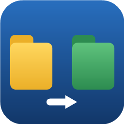

# CSSync

**Backup fácil de A para B, sem decorar parâmetros — interface gráfica em português para o `robocopy` (Windows) e o `rsync` (Linux).**

<br clear="left">

[](https://creativecommons.org/licenses/by/4.0/deed.pt-br)


[](linux/)


O **CSSync** é um painel de controle para a ferramenta de cópia mais confiável de cada sistema: o **`robocopy`** no Windows e o **`rsync`** no Linux. Ele **não copia nada por conta própria** — apenas monta o comando, mostra exatamente o que será executado e abre o console com o relatório oficial da ferramenta. Quem copia é o sistema; o aplicativo é só a interface.

> ℹ️ Este projeto se chamava **"Robocopy Fácil"**. Foi renomeado para **CSSync** ao ganhar a versão Linux, já que lá ele usa o `rsync` — o nome novo cabe nas duas plataformas.


## ✨ Recursos

- **3 modos de cópia com um clique**, cada um explicado na tela:
  - 🟢 **Atualizar backup (A → B)** — copia arquivos **novos e alterados**, pula idênticos, **não apaga nada** no destino. O botão do dia a dia.
  - 🟠 **Espelhar (A → B)** — o destino fica **idêntico** à origem, inclusive apagando o que não existe mais nela. Sempre pede confirmação.
  - 🔵 **Só arquivos novos** — copia apenas o que **não existe** no destino, sem tocar em nada que já está lá.
- **Opções da ferramenta** como caixas de seleção, cada uma com explicação em português na frente
- **Simulação 100% segura**: mostra o que seria copiado ou apagado **sem fazer nada de verdade**
- **Pré-visualização ao vivo** do comando exato antes de executar
- **Exclusões fáceis**: campos para ignorar arquivos e pastas
- **Cor do texto da janela de cópia** à sua escolha: verde estilo Linux (padrão), amarelo, ciano, branco e outras
- **Pastas de sistema ignoradas automaticamente** (Windows): `$RECYCLE.BIN`, `System Volume Information`, `Recovery`, `pagefile.sys`, `hiberfil.sys`, `swapfile.sys` — sem erros de acesso negado ao copiar a raiz de um drive
- **Janela de Ajuda colorida** explicando modos, códigos de saída e dicas
- **Janela redimensionável e maximizável**, que se ajusta a telas pequenas (14" / 1366×768)
- **Zero dependências no Windows**: usa apenas PowerShell + .NET, já incluídos em qualquer Windows 10/11

## 📥 Download e uso — Windows

**Opção 1 — Executável único (recomendado):**
baixe o `CSSync.exe` na [página de Releases](../../releases) e dê dois cliques. Pronto.

> ℹ️ Na primeira execução o Windows SmartScreen pode mostrar "aplicativo não reconhecido" (o executável não tem assinatura digital paga). Clique em **Mais informações → Executar assim mesmo**.

**Opção 2 — Script direto (sem executável):**
clone ou baixe este repositório e dê dois cliques em **`Iniciar - CSSync.bat`**.

## 🐧 Linux (rsync)

Há um porte nativo que faz exatamente o mesmo papel usando o **`rsync`** — origem (A) → destino (B), os mesmos 3 modos, simulação segura e cor do console. Tudo na pasta **[`linux/`](linux/)**, com interfaces Qt (Fedora/KDE) e Tkinter (Debian 12) e scripts para gerar instaladores `.rpm`/`.deb`. Veja [`linux/README.md`](linux/README.md) para as instruções completas.

> ⚡ **Exclusivo do Linux — cópia delta:** a versão Linux tem uma opção para o `rsync` transferir **apenas as partes que mudaram** de cada arquivo (em vez do arquivo inteiro). É a grande vantagem do rsync sobre o robocopy, ideal para arquivos grandes que mudam pouco (bancos de dados, VMs, vídeos). Vale para todos os modos.

## 🛡️ Segurança dos seus dados

- A pasta **FONTE (A) nunca é modificada**, em nenhum modo — a ferramenta só lê dela.
- O único modo que apaga algo (e somente no destino B) é o **Espelhar**, que sempre exige confirmação explícita.
- O botão **Simular** foi testado no pior cenário (simulação de espelhamento com arquivos que "seriam apagados"): nada foi copiado, alterado ou apagado — nem em A, nem em B.
- Antes do primeiro espelhamento, **simule** e leia a lista do que será feito.

## 🔧 Para desenvolvedores (Windows)

| Arquivo | Função |
|---|---|
| `CSSync.ps1` | Aplicativo completo (PowerShell + Windows Forms) |
| `Iniciar - CSSync.bat` | Atalho de execução do script |
| `gerar-icone.ps1` | Gera o `cssync.ico` e o `icone-256.png` programaticamente |
| `gerar-exe.ps1` | Compila o `CSSync.exe` com o módulo [ps2exe](https://github.com/MScholtes/PS2EXE) |

Para gerar o executável:

```powershell
Install-Module ps2exe -Scope CurrentUser   # uma única vez
.\gerar-exe.ps1
```

## 🤝 Como colaborar

Contribuições são muito bem-vindas!

1. **Abra uma issue** descrevendo o problema ou a sugestão (em português ou inglês).
2. Para enviar código: faça um **fork**, crie um branch (`git checkout -b minha-melhoria`), faça as alterações e abra um **Pull Request**.
3. Diretrizes:
   - Teste qualquer mudança na montagem de comandos usando o botão **Simular** antes de testar cópia real;
   - Mantenha os textos da interface em **português**, com explicações claras para usuários leigos;
   - No Windows, não adicione dependências externas — o aplicativo deve continuar rodando sem instalar nada;
   - Salve o `CSSync.ps1` em **UTF-8 com BOM** (necessário para os acentos no PowerShell 5.1).

Ideias abertas: perfis salvos de origem/destino, agendamento, tradução para outros idiomas.

## 📄 Licença

Este projeto está licenciado sob a [Creative Commons Atribuição 4.0 Internacional (CC BY 4.0)](https://creativecommons.org/licenses/by/4.0/deed.pt-br) — veja o arquivo [LICENSE](LICENSE).

Você pode usar, compartilhar e adaptar livremente, inclusive comercialmente, desde que dê o devido crédito a **Cristiano Silveira Silva**.

---

**© 2026 Cristiano Silveira Silva**
