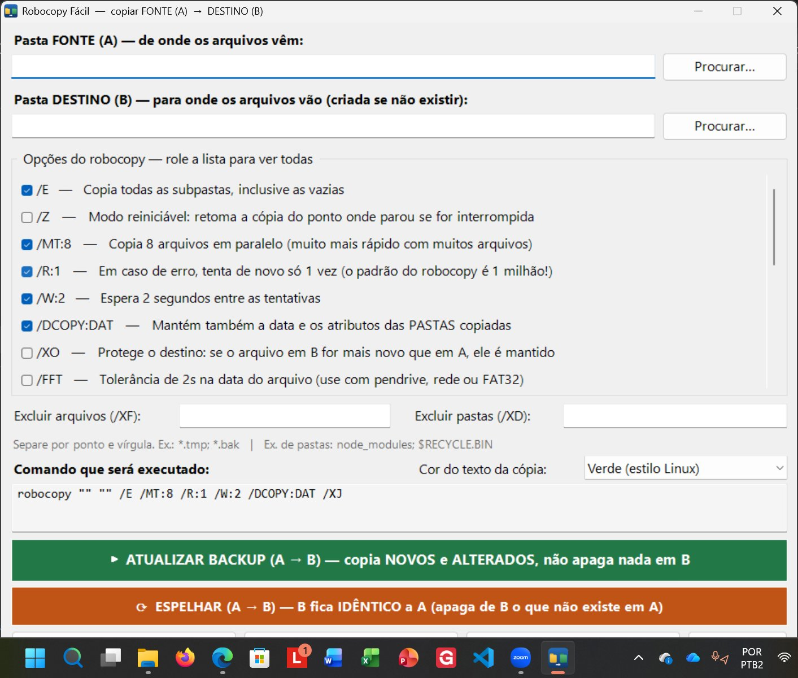
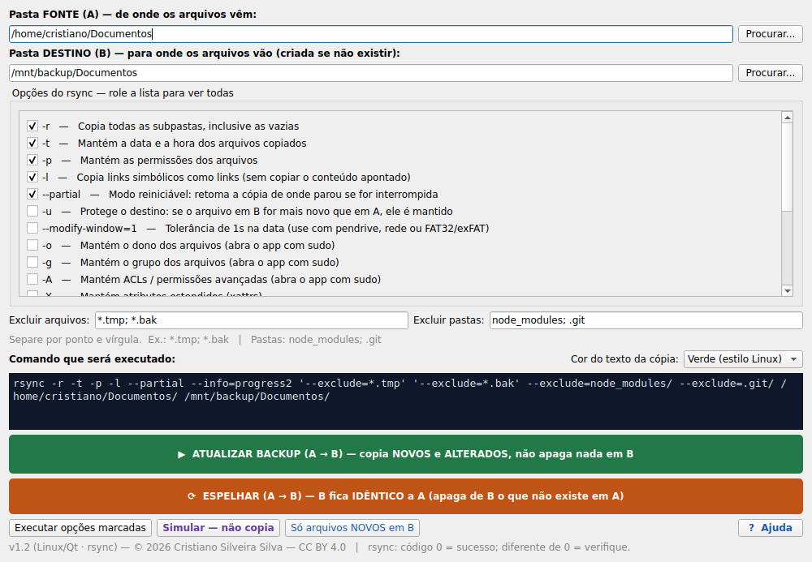

# Robocopy Fácil — versão Linux

Porte para Linux do **Robocopy Fácil** (Windows). A ideia é a mesma: você escolhe a pasta de origem (A) e a de destino (B), clica em um dos três modos e pronto. Por baixo, no lugar do `robocopy`, ele usa o **`rsync`** — o equivalente do Linux, que faz tudo o que o robocopy faz (e ainda transfere só o que mudou).

A pasta de origem (A) nunca é alterada.

São oferecidas duas interfaces com os mesmos recursos:

- **Qt (PySide6)** — visual nativo, recomendada (combina com o KDE/Plasma e fica bem no GNOME também).
- **Tkinter** — para o Debian 12, que não tem o PySide6 nos repositórios.

## Telas

**Versão Windows (PowerShell)**



**Versão Linux (Qt — KDE/Plasma)**



## Qual arquivo baixar

| Seu sistema | Arquivo em `dist/` | Interface |
|---|---|---|
| Fedora (Workstation ou KDE) | `robocopy-facil-1.2.0-1.noarch.rpm` | Qt (nativa) |
| Debian 13 (trixie) / Ubuntu 24.10+ | `robocopy-facil_1.2.0_all.deb` | Qt (nativa) |
| Debian 12 (bookworm) | `robocopy-facil_1.2.0_tkinter_all.deb` | Tkinter |

Para ver a sua versão do Debian: `cat /etc/debian_version`.

## Instalação

### Fedora
```bash
sudo dnf install ./dist/robocopy-facil-1.2.0-1.noarch.rpm
```
Dependências (instaladas automaticamente): `python3-pyside6`, `rsync`.

### Debian 13+ / Ubuntu recente
```bash
sudo apt install ./dist/robocopy-facil_1.2.0_all.deb
```
Dependências: `python3-pyside6.qtwidgets` (+ `qtgui`, `qtcore`), `rsync`.

### Debian 12
```bash
sudo apt install ./dist/robocopy-facil_1.2.0_tkinter_all.deb
```
Dependências: `python3-tk`, `rsync`.

> **Dica (KDE):** clicar duas vezes no `.rpm`/`.deb` às vezes abre o Discover, que prefere repositórios a arquivos locais. Se ele travar, use os comandos acima no Konsole — sempre funcionam.

Depois de instalar, procure por **Robocopy Fácil** no menu de aplicativos.

Para desinstalar: `sudo dnf remove robocopy-facil` (Fedora) ou `sudo apt remove robocopy-facil` (Debian).

## Rodar sem instalar

**Versão Qt:**
```bash
# Fedora:  sudo dnf install rsync python3-pyside6
# Debian:  sudo apt install rsync python3-pyside6.qtwidgets
python3 robocopy_facil_qt.py
```

**Versão Tkinter:**
```bash
# Fedora:  sudo dnf install rsync python3-tkinter
# Debian:  sudo apt install rsync python3-tk
python3 robocopy_facil_tk.py
```

## Como usar

- **Atualizar backup (A → B)** — copia arquivos novos e alterados, não apaga nada em B. É o botão do dia a dia.
- **Espelhar (A → B)** — deixa B idêntico a A: copia novos/alterados e **apaga de B** o que não existe mais em A. Pede confirmação.
- **Só arquivos novos em B** — copia apenas o que ainda não existe em B (não atualiza nem apaga).
- **Simular** — lista o que seria copiado ou apagado, sem fazer nada de verdade. Use antes do primeiro espelhamento.

A janela mostra o comando `rsync` exato antes de executar, e a cópia roda numa janela de console com a cor que você escolher.

## Compilar os pacotes a partir do código

```bash
# Gera os .deb (precisa de dpkg-deb — presente no Debian/Ubuntu)
bash packaging/build-deb.sh

# Gera o .rpm (precisa de rpmbuild — 'rpm-build' no Fedora, 'rpm' no Debian)
bash packaging/build-rpm.sh
```
Os pacotes são gravados na pasta `dist/`.

## Estrutura desta pasta

```
linux/
├── README.md                  # este arquivo
├── robocopy_facil_qt.py       # código-fonte (Qt / PySide6) — versão principal
├── robocopy_facil_tk.py       # código-fonte (Tkinter) — alternativa p/ Debian 12
├── packaging/                 # arquivos usados para empacotar
│   ├── robocopy-facil         # lançador (vai para /usr/bin)
│   ├── robocopy-facil.desktop # atalho do menu de aplicativos
│   ├── robocopy-facil.svg     # ícone
│   ├── build-deb.sh           # gera os .deb
│   └── build-rpm.sh           # gera o .rpm
└── dist/                      # instaladores prontos para baixar
```

> Os instaladores prontos ficam em `dist/` por conveniência. Se preferir manter o repositório enxuto, dá para movê-los para os *Releases* do GitHub e remover a pasta `dist/`.

## Equivalência robocopy → rsync

| robocopy | rsync |
|---|---|
| `/E` | `-a` |
| `/MIR` | `-a --delete` |
| `/COPYALL` | `-a -H -A -X` |
| só novos (`/XC /XN /XO`) | `-a --ignore-existing` |
| `/Z` | `--partial` |
| `/XF` `/XD` | `--exclude=` |
| `/L` (simular) | `-n` |
| `/LOG` | `--log-file=` |

Diferença de plataforma: o `/MT` (várias cópias em paralelo) do robocopy não tem equivalente no `rsync`, que é sequencial — mas ele compensa transferindo apenas o que mudou.

## Licença

Robocopy Fácil — © 2026 Cristiano Silveira Silva.
Licenciado sob **Creative Commons Atribuição 4.0 Internacional (CC BY 4.0)**, igual à versão Windows (veja o arquivo `LICENSE` na raiz do repositório).
